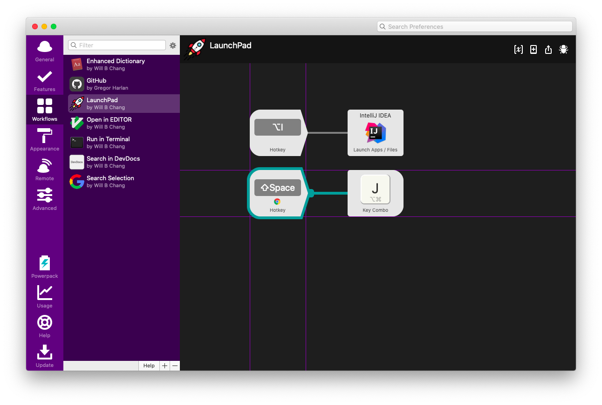

# Alfred Shortcut Shift+Space
Use <kbd>shift</kbd> + <kbd>space</kbd> as your shortcut trigger.



## Usage
NOTICE: I tried to export a workflow which contains the shortcut, it didn't work after import.
1. Open the workflow in Finder.
2. Open the `info.plist`.

    If your editor supports `.plist`, like Xcode.
    

    If you want to use text editor, find something like the code below:<br>
    NOTICE: There might be multiple shortcuts in one workflow.<br>
    This tool might be helpful: [Diff Checker](https://www.diffchefcker.com/u6GunNUY)
    ```xml
                     <key>hotkey</key>
                     <integer>49</integer>
                     <key>hotmod</key>
                     <integer>131720</integer>
                     <key>hotstring</key>
                     <string>Space</string>
    ```
3. Change/Add the `hotkey` value to `49`. 
4. Change/Add the `hotmod` value to `131072`.
5. Remember to save the changes in your editor.

Still want more? You can also try https://manytricks.com/keycodes/
```python
hotmod = {		131072 : "shift",
				262144 : "control",
				262401 : "control", 
				393216 : "shift+control",
				524288 : "option",
				655360 : "shift+option",
				786432 : "control+option",
				917504 : "shift+control+option",
				1048576 : "command",
				1179648 : "shift+command",
				1310720 : "control+command",
				1310985 : "control+command", 
				1441792 : "shift+control+command",
				1572864 : "option+command",
				1703936 : "shift+option+command",
				1835008 : "control+option+command",
				1966080 : "shift+control+option+command"
}
```

## Credits
<a href="https://github.com/shawnrice/alfred2-workflow-help">
  
</a>

## LICENSE
MIT
