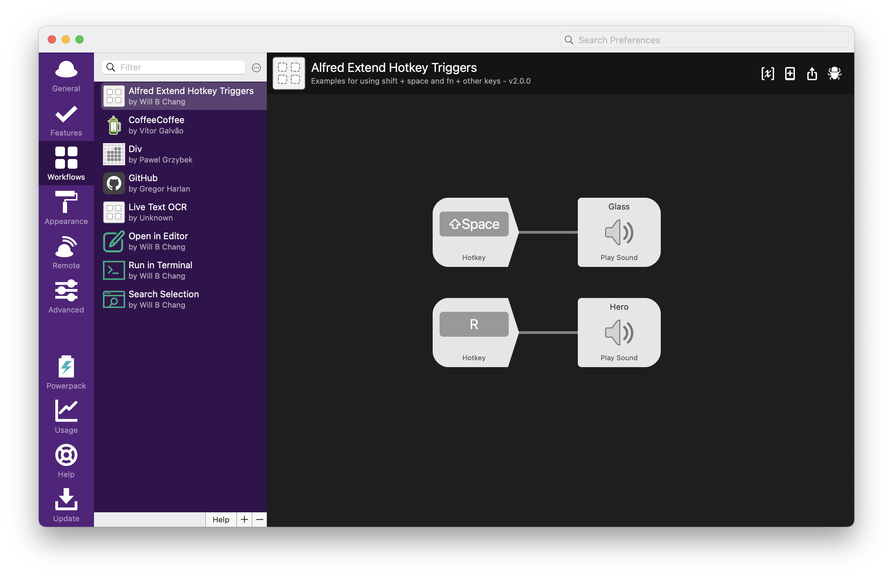
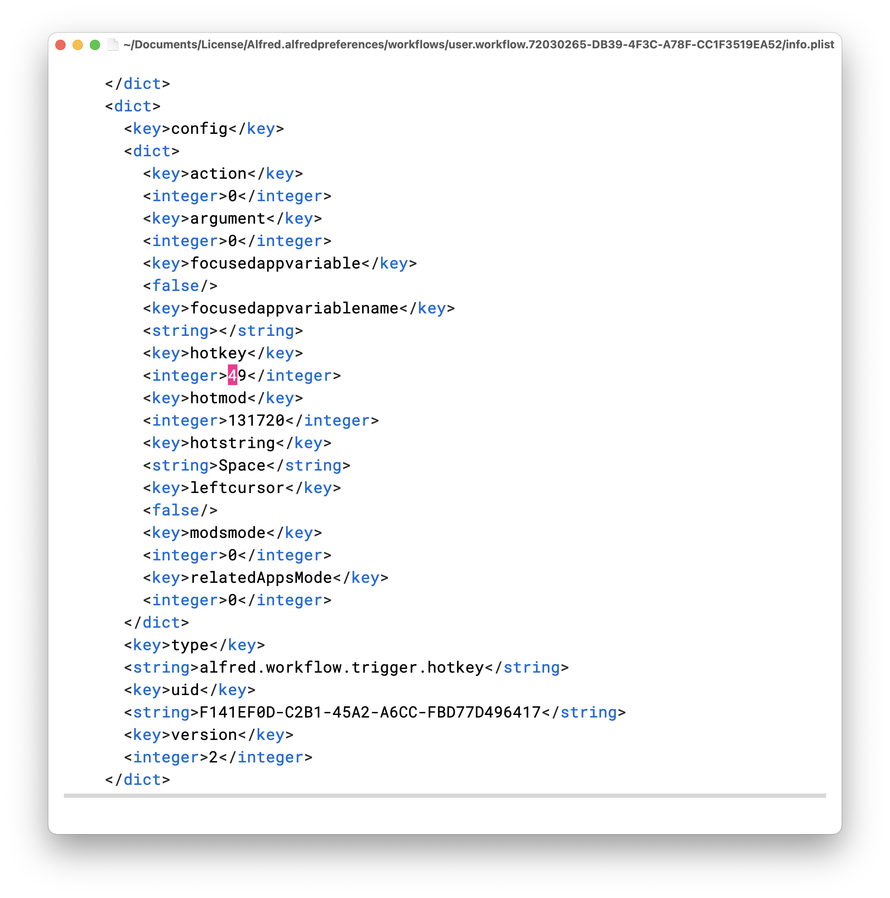

# Alfred Extend Hotkey Triggers
Use <kbd>Shift</kbd> + <kbd>Space</kbd> and <kbd>fn</kbd> + <kbd>somekey</kbd> as your hotkey triggers.

Please give me a star if it's helpful to you. ;)



## Usage
1. Create a blank workflow by clicking the `+` in the bottom of Workflows.
2. Open the workflow in Finder by right clicking the blank workflow.
3. Download [info.plist](https://raw.githubusercontent.com/willbchang/alfred-extend-hotkey-triggers/master/info.plist) (press <kbd>Alt</kbd> + `left click` to the link) and drag it to the folder to replace the default `info.plist`.
4. Wait for seconds and see the changes in the blank workflow.
5. Press <kbd>Shift</kbd> + <kbd>Space</kbd> and <kbd>fn</kbd> + <kbd>R</kbd> to test.

https://user-images.githubusercontent.com/14329786/152137289-1408e50e-5184-4d0a-a4be-ad152f2c9774.mp4

### Shift Space
1. Open the `info.plist` of your workflow.

    If your editor supports `.plist`, like Xcode:
    

    or in plain text editor, like Emacs:
    

    If you want to use text editor, find something like the code below:<br>
    NOTICE: There might be multiple shortcuts in one workflow.<br>
    This tool might be helpful: [Diff Checker](https://www.diffchecker.com/u6GunNUY)
```xml
                <key>hotkey</key>
                <integer>49</integer>
                <key>hotmod</key>
                <integer>131720</integer>
```
2. Change/Add the `hotkey` value to `49`.
3. Change/Add the `hotmod` value to `131720`.
4. Remember to save the changes in your editor.

### fn + somekey
This only test in macOS 12, versions below 12 may not be supported.
The code below represents <kbd>fn</kbd> + <kbd>R</kbd>.
```xml
                <key>hotkey</key>
                <integer>15</integer>
                <key>hotmod</key>
                <integer>8388608</integer>
```

### Still wants more?
**hotkeys**:


**hotmods**<br>
*Note: Some hotmods are duplicated, I haven't used them all so I didn't test. Pull request is welcome.*

| Hotmod Integers | Hotkey Modefiers                   |
|------------------|------------------------------------|
| 131072           | Shift                              |
| 131720           | Shift                              |
| 262144           | Control                            |
| 262401           | Control                            |
| 393216           | Shift + Control                    |
| 524288           | Option                             |
| 655360           | Shift + Option                     |
| 786432           | Control + Option                   |
| 917504           | Shift + Control + Option           |
| 1048576          | Command                            |
| 1179648          | Shift + Command                    |
| 1310720          | Control + Command                  |
| 1310985          | Control + Command                  |
| 1441792          | Shift + Control + Command          |
| 1572864          | Option + Command                   |
| 1703936          | Shift + Option + Command           |
| 1835008          | Control + Option + Command         |
| 1966080          | Shift + Control + Option + Command |
| 8388608          | Fn                                 |

**hotmod**:
## Credits
- [shawnrice/alfred2-workflow-help](https://github.com/shawnrice/alfred2-workflow-help/blob/80edd74030c9b4b61c87b5d44387dc56965e805c/help.py#L31-L48)
- [Complete list of AppleScript key codes](https://eastmanreference.com/complete-list-of-applescript-key-codes)

## LICENSE
AGPL-3.0
